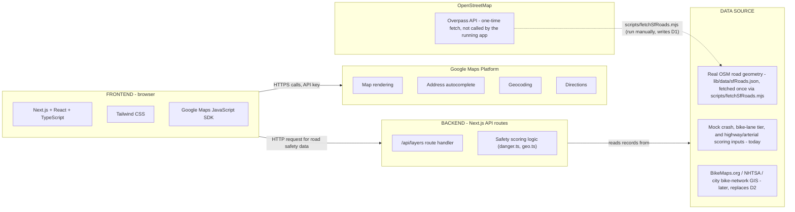

# Architecture

This document is meant to be a single source of truth for explaining the whole
project: what it does, how the pieces connect, what software/services it
depends on, where the data comes from, and a running log of what was built in
each phase. Keep it updated as the project evolves.

## Progress checklist

Check this section first for an at-a-glance status. See "Build log" at the
bottom for details on each completed phase.

- [x] Phase 0 - Project setup and documentation scaffold
- [x] Phase 1 - Domain model and mock data layer
- [x] Phase 2 - Danger scoring and geometry logic
- [x] Phase 3 - Backend API route
- [x] Phase 4 - Map visualization
- [x] Phase 5 - Routing and route comparison
- [ ] Phase 6 - Ride simulation and danger notifications
- [ ] Phase 7 - Polish and verification

**Tests**: `npm test` runs the Vitest suite - currently 72 tests across 8
files, all passing, covering the geometry helpers (including backtracking-loop
detection), the danger-zone scoring algorithm and road-network scoring, the
real SFMTA bike-lane dataset's shape/tier integrity, the 3-tier route-option
detour logic (fastest / overall-best-safe / absolute-safest), the Google
Directions ferry-leg filter and turn-by-turn step extraction, the mock
dataset's shape/determinism, the BikeMaps adapter stub, and the `/api/layers`
route.

## What this app does

A web app for cyclists that, given a start and end address in San Francisco:

1. Opens on a stock, uncluttered map - just two address fields, nothing else
   drawn - so the app never gets in the way of a first-time visitor typing in
   a trip.
2. The moment both an origin and destination are picked, automatically shows
   Google's own normal "fastest" bike route (no separate "find route" click
   needed), then streams in two safer alternatives as they finish computing:
   an "overall best safe route" (a reasonable middle ground) and an "absolute
   safest route" (keeps detouring until it clears every danger zone it can).
   Each is scored on the same three safety factors described below, using
   danger-zone data scored on three safety factors: crash/incident density,
   bike lane quality, and highway/high-speed-arterial exposure.
3. Lets you switch between all three routes at any time - the map instantly
   redraws to whichever one is selected - comparing distance, time, risk
   score, and % less danger-zone risk than Google's route.
4. Once you confirm a route, shows full turn-by-turn directions (every street
   and turn) for that specific choice.
5. (Planned, Phase 6) Lets you simulate riding the chosen route, firing an
   alert the moment the simulated rider enters a high-risk zone.

## Tech stack

| Layer | Technology | Why |
| --- | --- | --- |
| Frontend framework | Next.js (App Router) + React + TypeScript | One project for both UI and lightweight backend routes; fast to build |
| Styling | Tailwind CSS | Fast utility-class styling, no separate CSS files to manage |
| Map rendering | Google Maps JavaScript SDK, via `@react-google-maps/api` | Industry-standard mapping, Places autocomplete, Directions, Geocoding all in one platform |
| Backend | Next.js API routes (Node.js), same project as the frontend | No separate service to run/deploy for a hackathon timeline |
| Road geometry (today) | Real OpenStreetMap street data via the Overpass API, pre-fetched by `scripts/fetchSfRoads.mjs` into `lib/data/sfRoads.json` | What actually gets drawn on the map, so lines sit on real roads instead of hand-picked approximations |
| Crash/infra data (today) | Hardcoded synthetic TypeScript data (`lib/mockData.ts`) | Lets the safety-scoring logic be built/demoed without waiting on real crash-data access |
| Crash/infra data (future) | BikeMaps.org, NHTSA, city open-data / bike-network GIS portals | Real crash and infrastructure data sources, see "Data sources" below |

## Architecture diagram

- The frontend and backend are the *same Next.js project* - the "backend" is
  just API route handlers running in Node.js instead of in the browser.
- The frontend talks directly to Google's servers (map tiles, autocomplete,
  geocoding, directions) - the backend is not involved in those calls at all.
- The backend serves real road geometry (`lib/data/sfRoads.json`, generated
  ahead of time from OpenStreetMap) combined with crash/bike-lane/highway
  scoring inputs, currently a hardcoded mock dataset. The Overpass API is
  never called while the app is running - only by the one-time data-fetch
  script.

## The safety model: three factors, one composite score

The map renders ~210 real San Francisco streets - named freeways,
arterials, and cycleways, with actual OpenStreetMap road geometry (see
"Data sources" below) - as colored lines, each colored by a score sampled
along its real path (full green-to-red range, since some of these roads
are genuinely safe and some genuinely aren't). Every segment also has a
`kind` (`bikeLane` / `arterial` / `freeway`) that sets its line thickness
on the map ("the size of the road") independently of its color - a
freeway is drawn wide whether it scores safe or dangerous, same as any
real map. Ordinary unnamed/residential local streets are intentionally
excluded to keep the map readable rather than covering every possible
street; see `scripts/fetchSfRoads.mjs` for the exact inclusion thresholds.
Each sampled point is scored on three factors below.

1. **Neighborhood safety** - based on crash/incident density near that area
   (same underlying data as a traditional crash heatmap, but expressed as a
   0-100 risk score per zone instead of a diffuse gradient).
2. **Bike trail quality** - based on the nearest bike lane's quality tier:
   `fully protected` (best/lowest risk) > `semi-protected` > `unprotected`
   > `no bike lane` (worst/highest risk).
3. **Highway/arterial exposure** - based on distance to the nearest freeway
   (e.g. US-101, I-280, I-80) or known high-speed/high-traffic arterial road;
   closer and higher-speed roads score worse.

These three scores combine into one weighted **composite safety score**
(default weighting: 40% crash density, 30% bike infrastructure, 30% highway
exposure). The map has 4 toggleable layers: the 3 individual factors, plus
"Overall safety" (the composite, shown by default).

The route-safety logic (`lib/routing.ts`, `lib/danger.ts`) only cares about
the composite score plus a zone's location/radius - it doesn't need to know
about the 3-factor breakdown, so swapping in a different weighting scheme or
adding a 4th factor later would only require touching `lib/danger.ts`.

## Data sources

### Today: real road geometry + real bike-lane data + synthetic crash/highway data
Three different things now come from three different places:
- **Road geometry** (`lib/data/sfRoads.json`, generated by
  `scripts/fetchSfRoads.mjs`, loaded via `lib/dataSources/osmRoads.ts`) is
  **real**: actual OpenStreetMap street centerlines for ~210 named San
  Francisco freeways, arterials, and cycleways, fetched via the Overpass
  API. This is what's rendered on the map, so every line traces a real
  street.
- **Bike-lane infrastructure quality** (`lib/data/sfBikeLanes.json`,
  generated by `scripts/importSfmtaBikeLanes.mjs` from
  `data/raw/sfmta_bike_network.csv`, loaded via
  `lib/dataSources/sfmtaBikeLanes.ts`) is **real**: SFMTA's own official
  "Bike Network - Linear Features" open-data export, ~5,450 surveyed
  street-block segments, each already classified by SFMTA's own facility-type
  system - converted into our four-tier system (see build log below for the
  exact mapping). This is the scoring input for the "bike trail quality"
  factor.
- **Crash records and highway/arterial-type labels** (`lib/mockData.ts`) are
  still hardcoded, seeded-random data shaped like real records - they're
  *scoring inputs* (how risky is this area, how fast/major is the nearest
  highway), not the road shapes themselves. Lets the safety-scoring half of
  the app function end-to-end without waiting on real crash-data access.
  Not for real navigation decisions.

### Later: real crash/highway data sources (not yet wired up)
- **BikeMaps.org** (crowdsourced cycling collisions/near-misses/hazards/
  thefts). Important caveat discovered during research: BikeMaps.org does
  **not** expose a fully public, unauthenticated bbox-query REST API for
  third-party apps. Bulk/filtered data export requires either an admin
  account's "Export" page on their site, or direct database access -
  both require contacting the BikeMaps/SPARlab team
  (see `lib/dataSources/bikemaps.ts` for the documented adapter stub, ready
  to wire up once access is arranged).
- **NHTSA** (Traffic Safety Facts / FARS) - public fatal-crash statistics,
  useful for national context and severity calibration.
- **City open-data portals** (e.g. DataSF's traffic-injury-crash datasets) -
  jurisdiction-specific, non-fatal crash data, typically available as a
  public download or Socrata-style API, no special access needed.
- **City/OSM highway-classification GIS layers** - to replace the mocked
  freeway/arterial speed and type labels (bike-lane infrastructure is
  already real as of the swap above).

### Data flow for a future real-data swap
`lib/dataSources/bikemaps.ts` (and future `nhtsa.ts`, `cityOpenData.ts`)
define a converter into our internal `CrashRecord` type. Everything else in
the app - clustering, scoring, the API route, the map - is written against
`CrashRecord`/`BikeLaneSegment`/`HighwaySegment`, not against the mock data
directly. Swapping data sources means only changing what populates those
types, not the rest of the app.

## Known limitations (by design, for a hackathon-scoped v1)

- "Safer route" is computed with a heuristic (Google Directions + detour
  waypoints around the worst danger zone), not a custom routing graph with
  per-edge safety costs. It's demo-grade, not a rigorous optimizer.
- All crash/bike-lane/highway data is synthetic, not real.
- No user accounts, no persistence - state resets on page reload.
- No native mobile app / background GPS tracking; ride simulation is a
  client-side animation for demo purposes.
- Strava integration was explicitly discussed and deferred.

## Build log

Updated at the end of each implementation phase.

- **Phase 0** (project setup): Next.js + TypeScript + Tailwind app scaffolded,
  `@react-google-maps/api` installed, `.env.local.example` and this file
  created.
- **Phase 1** (domain model + mock data): `lib/types.ts` defines the shared
  types, including `BikeLaneSegment` (with `BikeLaneTier`:
  `fullyProtected`/`semiProtected`/`unprotected`/`none`), `HighwaySegment`,
  and `DangerZone` with a `factorScores` breakdown. `lib/mockData.ts` has
  synthetic SF crash clusters, ~9 mocked bike-lane corridor segments across
  varying quality tiers, and 7 mocked highway/arterial segments (US-101,
  I-280, I-80, plus Van Ness/Geary/Potrero/Masonic arterials).
  `lib/dataSources/bikemaps.ts` documents the real-data swap plan for all
  three factors (crash data via BikeMaps/NHTSA/city portals, bike
  infrastructure and highway data via OSM/city GIS layers).
- **Phase 2** (danger scoring logic): `lib/geo.ts` has distance helpers
  (point-to-point, point-to-polyline). `lib/danger.ts`'s
  `computeCompositeDangerZones` lays an ~180m grid over the city, scores
  each cell on the three factors (crash density within 260m, nearest bike
  lane tier within 130m, distance-weighted exposure to the nearest
  freeway/arterial), normalizes each to 0-100, combines them with fixed
  weights (40/30/30), and emits circular `DangerZone`s for cells scoring
  above a threshold (with nearby high-scoring cells de-duplicated to avoid
  clutter). Verified against the Phase 1 mock data: ~42 zones are produced,
  and the highest-scoring one lands near Potrero Ave/the US-101 interchange
  (crash density 91, bike infrastructure 100, highway exposure 100) - which
  matches real-world intuition about that area. `assessRouteRisk` and
  `suggestAvoidanceWaypoint` (used by the Phase 5 routing logic) round out
  the file. Rebuilt from scratch once at the user's request as a sanity
  check; re-verified it reproduces the same 42 zones.
- **Testing** (added after Phase 2, applies retroactively to Phases 0-2):
  installed Vitest (`npm test`), added `lib/geo.test.ts`,
  `lib/danger.test.ts`, `lib/mockData.test.ts`, and
  `lib/dataSources/bikemaps.test.ts`. 29 tests passing, covering: geometry
  math correctness, danger-zone score bounds/sorting/spatial separation/
  determinism, route-risk scoring on both a zone-crossing and a zone-free
  path, the avoidance-waypoint heuristic staying outside a zone's radius,
  mock-data shape and seeded-RNG determinism, and the BikeMaps GeoJSON
  conversion (including severity mapping and the fallback for unknown
  incident types). `npm run lint` also passes (1 harmless warning on an
  intentionally-unused stub parameter).
- **Phase 3** (backend API route): `app/api/layers/route.ts` is a GET
  handler returning `{ city, crashes, bikeLanes, highways, dangerZones }` as
  JSON, computing danger zones fresh on each request (cheap enough at this
  dataset size - tens of milliseconds). Added `app/api/layers/route.test.ts`
  and a `vitest.config.mts` (needed so Vitest resolves the `@/*` import
  alias the same way Next.js does). Verified two ways: the Vitest test
  calling `GET()` directly, and a real HTTP smoke test against
  `npm run dev` + `curl http://localhost:3000/api/layers`, confirming the
  live response matches (128 crashes, 9 bike lanes, 7 highways, 42 danger
  zones). `npm run build` and `npm run lint` both still pass.
- **Phase 4** (map visualization): `components/MapView.tsx` renders the
  Google Map with one `<Circle>` per zone, colored on a green -> yellow ->
  red gradient by score, plus A/B markers for a future origin/destination.
  `app/page.tsx` fetches `/api/layers`, adds a sidebar with the 4 layer
  toggles (overall/neighborhood/bike infra/highway) and a click-to-inspect
  factor breakdown for the selected zone.

  Follow-up refinement at the user's request: the original scoring only
  emitted zones for the ~42 worst cells above a danger threshold, so most of
  the map showed nothing. Changed `computeCompositeDangerZones` in
  `lib/danger.ts` to score and return **every** grid cell - safe and
  dangerous alike - instead of filtering/de-duplicating down to trouble
  spots only. Grid resolution moved from 180m/no-cap to 240m cells (868
  zones total for the demo city, computed in ~17ms, weight range 2.4-97.4)
  to keep that many circles rendering smoothly, with circle radius tuned to
  ~56% of the cell size so neighboring circles overlap just enough to avoid
  visible gaps between blocks. Lowered stroke opacity/weight on unselected
  circles so ~800+ overlapping outlines read as a soft gradient rather than
  a busy grid. Updated `lib/danger.test.ts` (removed the now-invalid
  "spatially separated"/"≤80 zones" assertions, added assertions for
  full-city coverage and a real safe-to-dangerous weight spread). All 30
  tests, `npm run build`, and `npm run lint` still pass. Note for Phase 5:
  since routes will now cross hundreds of low-weight zones by default, the
  waypoint-detour loop needs to stop based on a risk-score threshold rather
  than "zero zones crossed."

  Second follow-up, reverting most of the above at the user's request: full
  coverage looked wrong in practice - a uniform grid of same-size circles
  everywhere (including "safe" ones) doesn't read as a danger map. Replaced
  it with clustering: `computeCompositeDangerZones` samples a 180m grid,
  keeps only cells above a danger threshold (composite >= 64, back to
  omitting safe blocks rather than coloring them green), then flood-fills
  orthogonally-adjacent qualifying cells into a single connected cluster per
  contiguous problem area (diagonal-only adjacency was tried first and
  produced too-aggressive merging - two unrelated hot spots would bridge
  into one blob - so adjacency is now orthogonal-only). Each cluster becomes
  one `DangerZone` circle centered on the cluster's centroid, with radius
  driven by two things: how far the cluster's cells spread from that
  centroid, and a severity multiplier (1x at the threshold, up to ~1.9x at
  the worst possible score) - so one big circle for a whole bad stretch, a
  small circle for an isolated bad corner, and a bigger one the worse it
  gets. Radius is clamped to [90m, 380m] so no single circle can swallow
  the map. On the demo data this produces 10 zones (down from 868), radii
  from 99m-380m, weights 64.1-96.4 - matching the "handful of real trouble
  spots, sized by severity" mental model rather than either "42 uniform
  circles" or "800+ uniform circles everywhere." Updated
  `lib/danger.test.ts` to match (checks: below-threshold zones never
  appear, radii vary and stay in bounds, zone count stays in the dozens not
  hundreds). `components/MapView.tsx` styling reverted to fuller
  opacity/stroke now that zones are few and well-separated rather than
  hundreds of overlapping tiles. All 32 tests, `npm run build`, and
  `npm run lint` still pass.

  Third follow-up, at the user's request to replace circles with colored
  roads (closer to how Google Maps' traffic layer works, and less visually
  congesting than area blobs): added `computeDangerousRoadSegments` in
  `lib/danger.ts`, which shares the exact same grid-scoring/clustering as
  `computeCompositeDangerZones` (extracted into a shared
  `computeQualifyingClusters` helper so the two can never disagree on which
  areas are dangerous) but renders each cluster as a small mesh of 2-point
  line segments - one edge per pair of adjacent risky grid cells - instead
  of one bounding circle. An isolated risky cell with no qualifying
  neighbor still gets a short stub segment so it doesn't vanish. Segment
  color and stroke thickness both scale with the segment's score.
  `computeCompositeDangerZones` (circles) is kept, unused by the map, for
  future Phase 5 route-risk scoring, which is simpler against a
  circle+radius than a line-segment set. `app/api/layers/route.ts` now
  returns both `dangerZones` and `roadSegments`; `components/MapView.tsx`
  renders `Polyline`s instead of `Circle`s; `app/page.tsx` and the
  "selected zone" sidebar panel were updated to work off the selected road
  segment instead. On the demo data this produces 25 road segments across
  the same 10 underlying clusters. Added `lib/danger.test.ts` coverage for
  `computeDangerousRoadSegments` (non-empty/bounded count, 2-point paths
  within city bounds, no below-threshold segments, sorted output,
  determinism, and a geometric check that every segment sits within its
  corresponding circle-based zone, confirming the two representations stay
  consistent). All 38 tests, `npm run build`, and `npm run lint` pass.

  Fourth follow-up, at the user's request to color every road (not just
  risky ones) and size lines by real road type: replaced
  `computeDangerousRoadSegments` (only rendered clustered danger spots)
  with `computeRoadNetworkSafety` in `lib/danger.ts`. It scores every point
  on a coarser 300m synthetic grid (`localStreet` segments, standing in for
  ordinary city streets) plus every point along our named
  `MOCK_BIKE_LANE_SEGMENTS`/`MOCK_HIGHWAY_SEGMENTS` paths (tagged
  `bikeLane`/`arterial`/`freeway`), normalizing crash density once across
  every sample point so scores stay comparable across the whole network.
  No threshold/filtering - everything is included, safe or dangerous, so
  the map reads as a real green-to-red safety layer. `lib/types.ts` gained
  a `RoadKind` union and `RoadSafetySegment.kind`/`name` fields.
  `components/MapView.tsx` reverted to the full green-yellow-red gradient
  (removed in the earlier "no green" pass, now correct again since safe
  roads are meant to show) and now sets `strokeWeight` from a fixed
  per-`kind` table (freeway 9, arterial 6, bikeLane 4, localStreet 2) -
  road width now reflects real classification, not danger severity.
  `computeCompositeDangerZones` (circles) is untouched and still reserved
  for Phase 5 route-risk scoring. On the demo data this produces 1,069
  segments (1,053 local streets + 9 bike lanes + 4 arterials + 3 freeways)
  in ~16ms; named-road scores land intuitively (JFK Drive, car-free and
  fully protected: 2.4; Valencia St protected bikeway: 7; Polk St
  unprotected painted lane: 48.3; freeways/arterials cluster 52-66, since
  by nature they carry high highway-exposure risk for a cyclist). Rewrote
  `lib/danger.test.ts`'s road-network tests for full coverage (count >500,
  a genuine safe-to-dangerous score spread, every named bike
  lane/highway/arterial present and correctly tagged, determinism).
  Confirmed live via `curl` against `npm run dev` that `/api/layers`
  returns the same 1,069-segment breakdown. All 39 tests, `npm run build`,
  and `npm run lint` pass.

  Fifth follow-up, at the user's request to remove the grid: the synthetic
  300m local-street grid (1,053 of the 1,069 segments) was dropped from
  `computeRoadNetworkSafety` entirely. It now only scores and returns our
  16 actual named roads (9 bike lanes + 4 arterials + 3 freeways), each
  colored by a composite score sampled along its real path, crash density
  still normalized once across every sample point from every road so
  scores stay comparable. Removed `localStreet` from the `RoadKind` union
  in `lib/types.ts` and its width entry in
  `components/MapView.tsx` (`ROAD_WIDTH_BY_KIND`) since nothing produces it
  anymore. `lib/danger.test.ts` and `app/api/layers/route.test.ts` updated
  to expect exactly 16 segments instead of 1,069+. Confirmed live via
  `curl` that `/api/layers` now returns the same 16 named-road scores as
  before the grid was ever added (Geary Blvd 65.9 down to JFK Drive 2.4).
  All 39 tests, `npm run build`, and `npm run lint` pass.

  Sixth follow-up, at the user's request to put roads "actually on the
  Google Maps road" with every road colored green/orange/red: the 16
  hand-drawn named roads (2-6 straight-line points each, good enough as
  scoring inputs but never meant to be real geometry) were replaced as the
  *rendered* road set by real OpenStreetMap street data. Added
  `scripts/fetchSfRoads.mjs`, a one-time data-generation script (not run at
  request time - no live third-party dependency in the running app) that
  queries the Overpass API for every named `motorway`/`trunk`/`primary`/
  `secondary`/`cycleway` way inside `DEMO_CITY.bounds`, merges OSM's
  intersection-to-intersection way fragments back into connected per-street
  chains (endpoint-matching), decimates any chain over 80 points, and writes
  the result to `lib/data/sfRoads.json` ((c) OpenStreetMap contributors,
  ODbL - attribution added to the app footer in `app/page.tsx`). Filters:
  freeways/arterials need >=500m combined length per name (keeps ~165
  arterials + 23 freeways, not every 1-block "secondary"-tagged stub);
  cycleways only need >=100m (SF's named bike infrastructure, e.g. "The
  Wiggle" streets, is often just a few blocks). Result: 210 real named
  roads, 8,228 total path points, generated in ~20s (re-run via
  `npm run data:fetch-roads` if it ever needs refreshing).

  `lib/types.ts` gained `RealRoadSegment` (id/name/kind/path - the *input*
  to scoring) alongside the existing `RoadSafetySegment` (the *scored
  output*, unchanged shape). `lib/dataSources/osmRoads.ts` loads the JSON
  and exports it typed as `REAL_SF_ROADS`. `computeRoadNetworkSafety` in
  `lib/danger.ts` now takes a 4th `roads: RealRoadSegment[]` argument and
  scores/returns those (`app/api/layers/route.ts` passes `REAL_SF_ROADS`);
  `crashes`/`bikeLanes`/`highways` remain exactly what they were - scoring
  *inputs* (crash proximity, curated bike-lane tiers, curated highway
  exposure) - `MOCK_BIKE_LANE_SEGMENTS`/`MOCK_HIGHWAY_SEGMENTS` are no
  longer rendered directly but still drive those lookups.

  One correctness gap this surfaced: most of the 210 real roads have no
  matching entry in our 7 curated `MOCK_HIGHWAY_SEGMENTS`/9 curated
  `MOCK_BIKE_LANE_SEGMENTS` (those only ever modeled a handful of named
  corridors), so a real arterial like 19th Avenue or a real cycleway with no
  nearby curated tier would score highwayExposure=0 / bikeInfrastructure=100
  ("no lane at all") purely for not being one of the ~16 originally-curated
  streets - clearly wrong for a road OSM itself classifies as a primary
  arterial or a dedicated cycleway. Fixed with `scoreRoadPoint` in
  `lib/danger.ts`: a road's own real `kind` (from OSM) now sets a floor,
  not an override - `highwayExposure = max(proximityBasedScore,
  KIND_BASELINE_HIGHWAY_EXPOSURE[kind])` (freeway 85, arterial 35, bikeLane
  0), and any real cycleway's `bikeInfrastructure` risk is capped at
  "unprotected" (65) rather than "none" (100) even with no curated-tier
  match nearby. Proximity to an actually-curated hazard (e.g. running next
  to I-280) can still push scores above the floor.

  Updated `lib/danger.test.ts`: `computeRoadNetworkSafety` tests now assert
  against `REAL_SF_ROADS` (count matches exactly, >100 confirming real
  network-wide coverage, every real road's id/kind/name/path round-trips
  unchanged, known named corridors like Valencia Street Bikeway/Van Ness
  Avenue/Geary still present under their real geometry, cycleways never
  exceed 65 infra risk, freeways always carry >=85 exposure, bounds-slack
  bumped to 0.03° since real OSM ways run slightly past the demo bbox at
  their ends). `app/api/layers/route.test.ts` bumped its segment-count
  assertion from `>0` to `>100`. On live data: 210 segments (165 arterial +
  23 freeway + 22 bikeLane), scores 2.4-77.8, `/api/layers` responds in
  ~70ms. All 42 tests, `npm run build`, and `npm run lint` pass.

- **Phase 5** (routing and route comparison): implements the original brief's
  "compare Google's route to ours, and show why it's safer." Added
  `lib/routing.ts` with `computeRouteComparison(requestRoute, origin,
  destination, dangerZones)`: gets Google's normal ("fastest") bike route,
  scores it with the existing `assessRouteRisk`, and - if it crosses any
  danger zone - iteratively detours around the single worst zone still
  crossed at a time (via the existing `suggestAvoidanceWaypoint`), re-routing
  through every waypoint found so far each time. Stops as soon as risk drops
  below a threshold, no zones are crossed, a candidate detour fails to
  actually reduce risk (keeps the previous route instead - guards against
  Google's router folding a waypoint right back through the same hazard),
  or after 5 iterations. `requestRoute` is an injected function rather than
  a direct call to `google.maps.DirectionsService`, so this detour-planning
  logic has zero dependency on the Maps SDK and is fully unit-tested
  (`lib/routing.test.ts`, 4 tests) with fake routers - including a
  worst-first multi-zone cascade, a "detour doesn't help so keep the
  original" case, and a pathological case confirming the loop always
  terminates within the iteration cap instead of hunting forever.

  The real Google-backed implementation of `requestRoute` lives in the new
  `lib/googleDirections.ts` (`createGoogleDirectionsRouter`), which wraps
  `DirectionsService.route()` (bicycling mode) in a promise and flattens the
  result's `overview_path`/legs into the same `{ path, distanceMeters,
  durationSeconds }` shape `lib/routing.ts` expects - this is the only file
  that touches the Directions API directly.

  UI wiring in `app/page.tsx`: added origin/destination address fields using
  `@react-google-maps/api`'s `Autocomplete` (Places library, biased to the
  SF demo bounds via `bounds`/`strictBounds: false` so it doesn't hard-reject
  addresses just outside them), a "Find safer route" button that calls
  `computeRouteComparison` with a `DirectionsService` created once per
  session, and a comparison panel (distance/time/risk score/zones crossed,
  fastest vs. safer, plus the resulting "-X% less danger-zone risk" line).
  `components/MapView.tsx` gained `fastestRoutePath`/`saferRoutePath` props,
  rendered as a dashed gray polyline (Google's route) and a solid blue one
  (ours) on top of the existing safety-colored road network, so a user can
  see both the alternate path and *why* it deviates (which colored roads it
  avoids).

  Verified end-to-end against the *real* Google Directions API (not just
  unit tests against a fake router): a script drove `computeRouteComparison`
  with a `requestRoute` backed by the live Directions REST endpoint (same
  API key, same bicycling mode, same `/api/layers` danger zones as the app)
  for a real Market/Church-area -> Precita-area trip. Results: Google's
  fastest route is 2.81 mi / 18 min but cuts straight through the single
  worst danger zone on the map (South Van Ness & Mission, weight 96.4/100,
  riskScore 48.4); our safer route is 2.90 mi / 21 min (+3% distance, +3
  min) and crosses zero danger zones (riskScore 0, a 100% reduction) - one
  detour waypoint was enough. This is a real, live demonstration of the
  original project brief's core claim ("compare the route our model
  provides, and show why it's safer"). All 46 tests, `npm run build`, and
  `npm run lint` pass.

  Known limitation carried forward openly: `@react-google-maps/api`'s
  `Autocomplete` component wraps `google.maps.places.Autocomplete`, which
  Google marked legacy in March 2025 in favor of
  `PlaceAutocompleteElement` - it still works today (browser console just
  logs a deprecation notice) and Google states it "is not scheduled to be
  discontinued," so this was left as-is rather than a scope-creeping
  migration to a different component API for a hackathon-scoped v1.

  Follow-up fix, at the user's request ("we can't bike on ferry routes"):
  confirmed empirically against the live Directions API that Google's
  `BICYCLING` mode will happily propose boarding a ferry when there's no
  continuous bike-accessible path (e.g. SF Ferry Building -> Alameda) -
  and does so as a step whose `travel_mode` is still `"BICYCLING"` (Google
  treats "put your bike on the boat" as part of the bicycling journey, not
  a separate transit leg), with the tell being `step.maneuver === "ferry"`
  instead. Added `isFerryStep`/`isBikeableRoute` to
  `lib/googleDirections.ts`, checking three signals for robustness (a
  genuine `TRANSIT`-mode step, `maneuver === "ferry"`, and a narrow
  "ferry to <destination>" text-instruction fallback - deliberately *not*
  a bare `/ferry/i` match, since this app's own demo data has a hazard
  cluster right at the Embarcadero/Ferry Building and a real bikeable route
  through there can easily produce an instruction like "Turn right onto
  Ferry Building Marketplace"). `createGoogleDirectionsRouter` now requests
  `provideRouteAlternatives: true` and picks the first alternative that
  passes `isBikeableRoute`, rejecting with a clear, user-facing error
  ("Google has no all-bicycle route between these points...") if every
  option Google offers requires a ferry, rather than silently handing back
  an unrideable route - this surfaces through the existing `routingError`
  UI state in `app/page.tsx` with no further UI changes needed. Added
  `lib/googleDirections.test.ts` (10 tests) covering all three detection
  signals, the Embarcadero false-positive case, multi-leg routes, and
  `extractRoute`'s distance/duration summing - all using plain fake step/
  route objects with no dependency on the Maps SDK being loaded. Verified
  live against the real Directions API: the Ferry Building -> Alameda case
  now correctly throws instead of returning a route, while the existing
  Castro -> SoMa example (no ferry involved) is unaffected. All 56 tests,
  `npm run build`, and `npm run lint` pass.

  Follow-up fix, at the user's request ("make sure the chosen route doesnt
  have weird loops"): Google's waypoint-based detour routing (the mechanism
  `lib/routing.ts` uses to force a route around a danger zone) can sometimes
  satisfy a "must pass through this point" constraint by tacking on a short
  there-and-back spur - heading a block or two toward the waypoint, then
  immediately reversing - rather than finding a sensible new path through it,
  especially when `suggestAvoidanceWaypoint`'s offset point sits awkwardly
  relative to the route's natural direction of travel. Added
  `hasBacktrackingLoop(path)` to `lib/geo.ts`: it walks consecutive
  "substantial" segments (filtering out sub-25m segments, which are just
  intersection noise) and flags any pair of consecutive segments, each
  between 25m and 2km long, whose bearings differ by 150 degrees or more -
  a near U-turn far sharper than any real street-grid corner. The 2km upper
  bound is deliberate: a large, multi-kilometer detour that happens to
  reverse the route's *overall* heading (e.g. going a long way around one
  side of a hazard before heading back toward the destination) is a
  legitimate routing choice, not a bug - the artifact this targets is
  specifically a short, local spur. `computeRouteComparison` in
  `lib/routing.ts` now rejects a candidate detour (keeping the previous,
  still-crossing route instead, same as the existing "didn't reduce risk"
  guard) if `hasBacktrackingLoop` flags it, so a route that technically
  clears a danger zone but does so via a nonsensical loop is never surfaced
  to the user. Added 4 tests to `lib/geo.test.ts` (straight line, a normal
  90-degree-turn street-grid detour, a short jog under the minimum segment
  length, and a genuine there-and-back spur) and 1 to `lib/routing.test.ts`
  (a candidate that clears the zone but loops gets rejected, same call count
  and outcome as the "doesn't help" case). All 61 tests, `npm run build`,
  and `npm run lint` pass.

  Also at the user's request, changed every text color in the left sidebar
  (`app/page.tsx`'s `<aside>`) to plain black (`text-black`), replacing the
  prior mix of slate grays and blue/red accent colors used for labels, the
  route-comparison table, error messages, and the attribution footer. Left
  the "Find safer route" button's white-on-blue label untouched, since that's
  a button style rather than body text and inverting it would hurt
  legibility; the full-page "missing API key" / "failed to load Google Maps"
  states (which replace the whole page, not just the sidebar) were likewise
  left as-is.

  Follow-up fix, at the user's request ("old routes are not removed - if I
  find A to B, then B to C, it keeps A to B in blue"): root-caused to a
  well-known Google Places Autocomplete gotcha - `place_changed` only fires
  when the user actually clicks/selects a dropdown suggestion, not on every
  keystroke. The origin/destination `<input>`s had no `onChange` handler, so
  if a user retyped over an old address and pressed Enter or clicked away
  without picking a fresh suggestion, React's `origin`/`destination` state
  silently kept pointing at the *previous* selected place (say, A and B)
  while the input visually showed new text - so re-clicking "Find safer
  route" just recomputed and redrew the same old A-to-B route instead of
  erroring or waiting for a real B-to-C selection. Fixed by wiring an
  `onChange` on both inputs (`handleAddressInputChange`) that immediately
  clears the corresponding coordinate to `null` on every keystroke -
  Google's own programmatic update of the input's text when a suggestion
  *is* picked doesn't fire a native `input` event, so this only fires on
  genuine user typing, not on a real selection - which also disables the
  "Find safer route" button (`disabled={!origin || !destination || ...}`)
  until a fresh, valid pick is made. Also introduced `updateOrigin`/
  `updateDestination` wrapper setters (used by both `onPlaceChanged` and the
  new `onChange`) that clear `routeComparison`/`routingError` alongside the
  coordinate, so any previously-drawn route disappears from the map the
  instant a new valid point is chosen rather than lingering until the next
  search resolves. Separately hardened `handleFindRoute` against a genuine
  race condition (rapidly re-clicking "Find safer route" before an earlier,
  slower lookup has resolved) with a monotonically-increasing
  `routeRequestIdRef` - a request's result/error is only applied to state if
  no newer request has started since, so an older, slow in-flight response
  can never clobber a newer one. (An earlier version of the first fix used a
  `useEffect([origin, destination])` calling `setState` directly, which
  `eslint-plugin-react-hooks`'s `set-state-in-effect` rule correctly flagged
  as effect-triggered cascading renders; moved the logic into the setter
  functions themselves instead, which is both simpler and lint-clean.) All
  61 tests, `npm run build`, and `npm run lint` pass; this is a browser/DOM
  event-ordering fix with no pure-logic unit to test in Vitest.

  Follow-up data swap, at the user's request ("here is some real data as a
  csv, swap it with the mock data"): replaced `MOCK_BIKE_LANE_SEGMENTS`
  (9 hand-picked corridors in `lib/mockData.ts`) with the real SFMTA "Bike
  Network - Linear Features" open-data export the user provided - SF's own
  official record of its bike infrastructure, one row per surveyed street
  block (~5,450 usable rows). The raw CSV lives at
  `data/raw/sfmta_bike_network.csv`; `scripts/importSfmtaBikeLanes.mjs`
  (`npm run data:import-bike-lanes`) parses it (hand-rolled CSV/WKT parsing -
  no new dependency needed) and writes the compact
  `lib/data/sfBikeLanes.json`, loaded via the new
  `lib/dataSources/sfmtaBikeLanes.ts` (`REAL_SF_BIKE_LANES`) - the same
  fetch-once-commit-the-JSON pattern already used for OSM road geometry
  (`scripts/fetchSfRoads.mjs`). Tier mapping uses SFMTA's own official
  facility-type classification (see SFMTA's bikeway-network definitions):
  `CLASS I` (off-street path) and `CLASS IV` (separated bikeway, physically
  barrier-protected) -> `fullyProtected`; `CLASS II` (painted lane) with the
  source's own `BUFFERED=YES` flag -> `semiProtected`, otherwise ->
  `unprotected`; `CLASS III` (bike route/sharrow, no dedicated lane space)
  -> `none`. 2 malformed source rows (blank facility type *and* geometry)
  are skipped.

  This is a large jump in both data quality and volume - real per-block
  classifications for the whole city instead of 9 guessed corridors - which
  immediately exposed a real performance problem: `scoreBikeInfrastructure`
  in `lib/danger.ts` did a naive "distance to every segment" scan, fine
  against 9 mock segments but O(n) against ~5,450 real ones, called once per
  danger-zone grid cell *and* once per point along every one of the ~210
  real roads. `/api/layers` went from effectively instant to ~2.4s per
  request. Fixed with a simple spatial hash: segments are bucketed into a
  ~150m grid (matching `BIKE_LANE_SEARCH_RADIUS_METERS`), built once per
  distinct `bikeLanes` array (cached in a `WeakMap` keyed by array
  reference) and reused for every query against it - since every caller
  passes the same shared `REAL_SF_BIKE_LANES` constant, in practice this
  index is built exactly once per server process. A lookup now only checks
  the ~9 buckets around the query point instead of the whole dataset.
  Result: `/api/layers` dropped from ~2.4s to ~0.1s (verified against a live
  `next dev` server, not just unit tests), a ~24x improvement, with
  identical scoring results (same 65 tests pass before and after; the
  dropped-then-restored total test-suite wall time, ~5.9s -> ~1.6s, is a
  visible proxy for the same fix, since `lib/danger.test.ts` exercises this
  code path directly).

  Also removed `bikeLanes` from the `/api/layers` JSON response entirely
  (`crashes`/`highways`/`dangerZones`/`roadSegments` are unaffected): it was
  only ever a server-side scoring input, never rendered by the UI
  (`app/page.tsx`'s `LayersResponse` type never included it), so shipping
  all ~5,450 real segments - about 2MB of JSON - to the browser on every
  page load would have been pure dead weight now that the dataset is no
  longer tiny. `app/api/layers/route.test.ts` was updated accordingly.

  Spot-checked correctness against a real, well-known corridor: Valencia
  Street has been a flagship SF protected (Class IV) bikeway since its
  2019-2021 redesign, and the real data confirms it - 43 of its 52 surveyed
  segments are `CLASS IV`, so it now correctly scores
  `bikeInfrastructure: 8` (`fullyProtected`) end to end through
  `computeRoadNetworkSafety`, versus a hand-guessed `fullyProtected` tag on
  an approximate hand-drawn polyline before. Added
  `lib/dataSources/sfmtaBikeLanes.test.ts` (6 tests: dataset size floor, all
  four tiers present, every segment has a valid tier/name/real path points,
  unique ids, the Valencia spot-check, and a rough SF-peninsula bounding-box
  sanity check) and updated `lib/danger.test.ts`/`lib/mockData.test.ts` to
  use `REAL_SF_BIKE_LANES` in place of the now-deleted
  `MOCK_BIKE_LANE_SEGMENTS`. All 65 tests, `npm run build`, and
  `npm run lint` pass.

  Follow-up UX redesign, at the user's request (a specific, staged flow:
  stock map on load -> auto-show Google's route -> pick between three route
  tiers -> confirm -> turn-by-turn): replaced the single "fastest vs. safest"
  comparison with three tiers and made route-finding fully automatic instead
  of button-driven.

  `lib/routing.ts`: `computeRouteComparison` (2 routes) was replaced by
  `computeRouteOptions` (3 routes: `fastest`, `balancedSafe`, `safest`),
  built on a shared `runDetourLoop` helper extracted from the old detour
  logic. `balancedSafe` behaves exactly like the old "safest" (stops once
  risk drops to/below a threshold of 20, or after 5 iterations) - it's now
  positioned as the "reasonable middle ground" tier. `safest` is new: it
  *continues* the detour loop from wherever `balancedSafe` left off (reusing
  its waypoints, so upgrading tiers costs no redundant Directions API calls)
  with the stop threshold dropped to 0 (must clear every zone, not just get
  "low enough") and a higher combined iteration budget (10 total). Progress
  callbacks (`onFastest`, `onBalancedSafe`) let the UI reveal each tier the
  moment it's ready rather than blocking on all three - Google's own route
  typically resolves in under a second, so it appears near-instantly while
  the two safety tiers keep computing in the background. Added
  `improvedRiskPercent(fastest, other)` as a small shared helper for the "-X%
  less risk than Google's route" line, now computed per-tier instead of
  baked into the comparison result. Rewrote `lib/routing.test.ts` (13 tests)
  to cover the new 3-tier shape, most notably a test that specifically
  differentiates the two safety tiers: a route with a severe zone (weight 90)
  and a mild one (weight 15) that alone sits right at the balanced pass's
  stop threshold, showing `balancedSafe` stopping with that mild zone still
  crossed while `safest` keeps going and clears it too.

  `lib/googleDirections.ts`: `extractRoute` now also pulls turn-by-turn
  `steps` (instructions/distance/duration) off every leg, needed for the new
  "confirm route" panel. Google's `instructions` field is a small HTML
  fragment (e.g. `Turn <b>right</b> onto <b>Valencia St</b>`, sometimes with
  a nested `
` sub-line like "Restricted usage road") - added
  `stripInstructionsHtml` to turn that into plain, readable text (strips
  tags, decodes the handful of entities Google actually emits: `&amp;`,
  `&nbsp;`, `&#39;`, `&quot;`). Added `RouteStep` to `lib/types.ts` and 5 new
  tests to `lib/googleDirections.test.ts` covering step flattening across
  legs and HTML/entity stripping.

  `components/MapView.tsx`: replaced the old always-both
  `fastestRoutePath`/`saferRoutePath` props with a single `selectedRoute`
  prop (`{ kind, path } | null`) - only one route is ever drawn at a time now
  (color keyed by tier: gray for `fastest`, amber for `balancedSafe`, green
  for `safest`), matching the "select any of these three and it auto
  switches" requirement instead of always overlaying two routes for
  comparison. The existing colored safety-road-network overlay
  (`roadSegments`/`activeLayer`/`selectedSegmentId`/`onSegmentClick`) was
  made fully optional (defaults to not rendering anything) rather than
  removed, since the new default flow doesn't use it but the underlying
  scoring/data pipeline is untouched and still fully tested.

  `app/page.tsx`: rewritten around the requested flow. The sidebar now shows
  *only* the two address fields until both are filled in (the "stock,
  no-lines" initial screen) - `/api/layers` is still fetched proactively on
  mount (cached in a ref-held promise, shared by every caller) so it's
  already warm by the time a route search needs it, but nothing is rendered
  from it up front. The moment both `origin`/`destination` are set (via the
  existing `updateOrigin`/`updateDestination` wrappers, no separate button),
  a route search starts automatically and streams results into a `routes`
  state object as each tier's callback fires. A "Choose a route" panel shows
  all three tiers as selectable rows (distance/time once ready, "Computing…"
  placeholder otherwise); clicking a ready one swaps `selectedRouteKind`,
  which immediately redraws the map and updates the stats panel below (risk
  score, zones crossed, % less risk vs. Google). A "Confirm route" button
  (enabled once the selected tier is ready) reveals a turn-by-turn list of
  that route's `steps`. Changing the selected tier after confirming
  un-confirms it, so the turn-by-turn panel always matches a deliberate
  choice for whichever route is currently active. The old "Danger layer"
  radio picker and per-segment detail panel were removed from the default UI
  (not from the codebase - `MapView` still supports them) since they weren't
  part of the requested flow. All 72 tests, `npm run build`, and
  `npm run lint` pass.

  Follow-up, at the user's request (a specific list of 15 known-dangerous SF
  locations - Tenderloin core intersections, Mid-Market, 6th St, 16th/24th &
  Mission, Civic Center/UN Plaza, Bayview's 3rd St corridor, Sunnydale/
  Visitacion Valley - "have our optimized route skip over these"): fed these
  through the existing synthetic-crash pipeline rather than hardcoding them
  as always-shown zones, so they're ranked and merged exactly like every
  other hazard the model already knows about ("or any other ones"). Added
  `KNOWN_DANGEROUS_LOCATIONS` to `lib/mockData.ts` - same shape as the
  existing invented `HAZARD_CLUSTERS`, but explicitly documented as this
  literal user-provided list, each generating a batch of synthetic crash
  records around its approximate coordinates. `DEMO_CITY.bounds` had to
  widen south (37.742 -> 37.705) and east (-122.388 -> -122.383) to actually
  reach Bayview and Sunnydale - the danger-zone grid only ever samples
  inside these bounds, so a hotspot outside them would silently never
  surface no matter how much crash data it has (a real gotcha here: this
  also means the grid got ~55% bigger, though `/api/layers` is still
  comfortably fast, ~200-300ms).

  This immediately surfaced a real, previously-latent flaw in the danger
  model: `computeCompositeDangerZones` normalized crash density against
  whichever grid cell had the single highest raw density *in the current
  dataset*. Several of the new Tenderloin-core locations sit only 1-3 blocks
  apart, so their 260m crash-search radii overlap and compound - one
  resulting hotspot's raw density came out ~4x any prior cluster's. Every
  other area's *relative* score is a fraction of whatever that single
  densest spot happens to be, so adding one very dense cluster anywhere
  silently suppressed nearly everything else's score map-wide - first
  attempt at this feature actually caused total zone count to *collapse*
  from several to just 4. Root cause confirmed by literally re-running the
  scoring against the pre-change code and data side by side. Fixed by
  replacing the dynamic per-request max with a fixed `CRASH_DENSITY_REFERENCE`
  constant (calibrated against this app's own mock cluster shapes) in both
  `computeCompositeDangerZones` and `computeRoadNetworkSafety`, so crash
  density reads on an absolute scale that doesn't shift every time more data
  is added - the old `normalize()` helper (dynamic-max, generic) was
  replaced with `normalizeCrashDensity()` (fixed-reference, crash-density-
  specific). Verified this is a strict improvement, not just a different
  tradeoff: re-ran the original 10 invented `HAZARD_CLUSTERS` against both
  the old and new code - every cluster that used to clear the danger
  threshold still does, and one (the Folsom St corridor) now newly clears it
  too, while all 15 of the user's named locations now clear it as well
  (verified each one falls within some resulting zone's radius, not just
  "a zone exists somewhere") - up from a pre-existing baseline of only 4 of
  the original 10 clusters clearing the threshold at all. Total zone count
  went from 7 (original data) to 12 (original + all 15 new locations,
  several merging together where geographically adjacent, e.g. the
  Tenderloin core intersections collapse into two large connected blobs -
  "if a whole area is bad just use one bigger circle," per the standing
  clustering design).

  Added a "Neighborhood view" toggle to `app/page.tsx` (off by default, same
  "stock map on load" principle as the rest of this phase) that renders
  every current danger zone as a translucent circle on the map - brought
  back `Circle` rendering to `components/MapView.tsx` (new optional
  `dangerZones` prop, reusing the same green-to-red `dangerColor` gradient
  already used for the road-safety overlay; since every zone here is already
  above the danger threshold, in practice they all land in the orange/red
  end of it) after it had been fully replaced by the colored-road-network
  view in Phase 4 - this is a distinct, deliberately reintroduced feature
  (a literal "show me the dangerous areas" layer) rather than a leftover.

  No routing code changes were needed for the actual avoidance behavior -
  `computeRouteOptions` already detours around any zone in the `dangerZones`
  list it's given, regardless of where that zone came from, so once these
  locations surfaced as real zones they were automatically in scope for the
  existing detour logic. Verified live against the real Directions API
  (not just unit tests): a Financial District -> NoPa trip has Google's
  default bike route crossing 2 danger zones (riskScore 118.6, including the
  Van Ness Ave corridor); `balancedSafe`/`safest` both find a detour that
  clears one of them entirely, dropping to riskScore 80.7 (a real ~32%
  reduction) with only a modest distance/time cost. Also confirmed, and
  worth stating plainly rather than glossing over: the very large merged
  Tenderloin-core zones (some hit the 380m radius cap, i.e. span several
  blocks) aren't always fully avoidable for a route that has to pass through
  the neighborhood at all - a couple of other test trips through the
  downtown core saw no improvement, since every alternative Google's router
  found still clipped some part of the same wide zone. This matches the
  detour heuristic's documented, known limitation (`suggestAvoidanceWaypoint`
  in `lib/danger.ts`: "a lightweight heuristic... a production system would
  instead run routing on a custom street graph with per-edge safety costs")
  rather than being a new bug introduced here - it reduces risk whenever a
  reasonable alternate street exists, but can't shrink-wrap around an entire
  multi-block neighborhood the way a real edge-weighted router could.

  Also restarted `npm run dev` in the background per the user's request to
  keep localhost available continuously while iterating. Updated
  `lib/mockData.test.ts`'s crash-count assertion (128 -> 349, purely
  mechanical - more synthetic crash points from the 15 new clusters). All 72
  tests, `npm run build`, and `npm run lint` pass.
